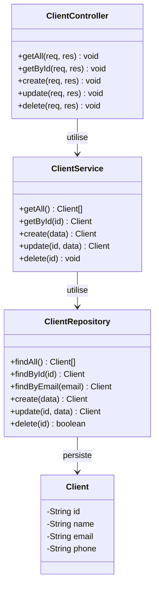
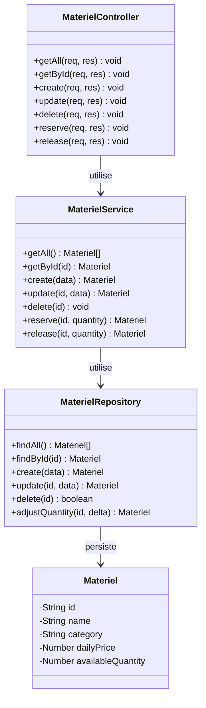
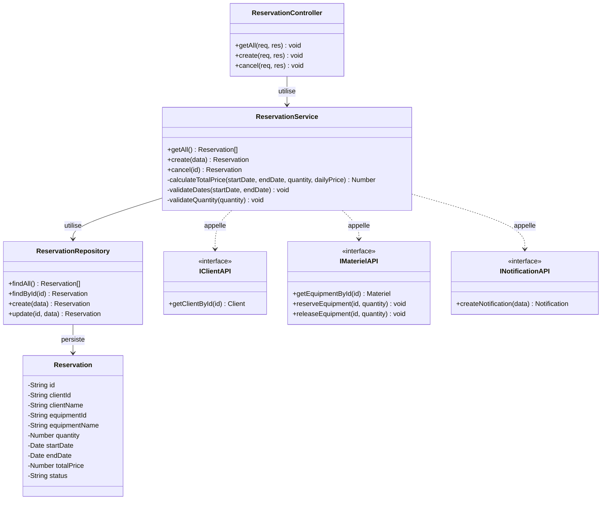
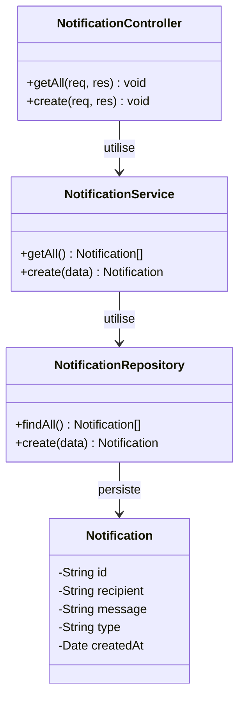

# Laboratoire 1 — Eventia Location
## Analyse et conception — Exigences, User Stories, Diagrammes UML

---

## 1. Liste des exigences fonctionnelles

### 1.1 Gestion des clients
- **RF-01** Le système doit permettre d'enregistrer un nouveau client (nom, courriel, téléphone).
- **RF-02** Le système doit garantir l'unicité du courriel d'un client (aucun doublon accepté).
- **RF-03** Le système doit permettre de consulter la liste de tous les clients.
- **RF-04** Le système doit permettre de consulter un client précis par son identifiant.
- **RF-05** Le système doit permettre de modifier les informations d'un client existant.
- **RF-06** Le système doit permettre de supprimer un client.

### 1.2 Gestion du matériel
- **RF-07** Le système doit permettre d'ajouter un équipement (nom, catégorie, prix quotidien, quantité disponible).
- **RF-08** Le système doit permettre de consulter la liste de tous les équipements.
- **RF-09** Le système doit permettre de consulter un équipement précis par son identifiant.
- **RF-10** Le système doit permettre de modifier un équipement existant.
- **RF-11** Le système doit permettre de supprimer un équipement.
- **RF-12** Le système doit permettre de diminuer (réserver) la quantité disponible d'un équipement.
- **RF-13** Le système doit refuser une réservation de stock si la quantité disponible est insuffisante.
- **RF-14** Le système doit permettre de remettre (libérer) une quantité réservée dans l'inventaire.

### 1.3 Gestion des réservations
- **RF-15** Le système doit permettre de créer une réservation à partir d'un client, d'un équipement, d'une quantité, d'une date de début et d'une date de fin.
- **RF-16** Le système doit vérifier que le client existe avant d'accepter la réservation.
- **RF-17** Le système doit vérifier que l'équipement existe avant d'accepter la réservation.
- **RF-18** Le système doit vérifier que la quantité demandée est disponible avant d'accepter la réservation.
- **RF-19** Le système doit rejeter la réservation si la date de fin précède la date de début.
- **RF-20** Le système doit rejeter la réservation si la quantité demandée est inférieure à un.
- **RF-21** Le système doit calculer le prix total = nombre de jours (premier et dernier jour inclus) × quantité × prix quotidien.
- **RF-22** Le système doit permettre de consulter la liste de toutes les réservations.
- **RF-23** Le système doit permettre d'annuler une réservation existante.
- **RF-24** Lors de la confirmation d'une réservation, le système doit diminuer la quantité disponible de l'équipement concerné.
- **RF-25** Lors de l'annulation d'une réservation, le système doit remettre la quantité dans l'inventaire.

### 1.4 Gestion des notifications
- **RF-26** Le système doit générer automatiquement une notification lors de la confirmation d'une réservation.
- **RF-27** Le système doit générer automatiquement une notification lors de l'annulation d'une réservation.
- **RF-28** Le système doit permettre de consulter la liste des notifications, triée de la plus récente à la plus ancienne.
- **RF-29** Les notifications sont uniquement persistées en base de données ; aucun envoi réel de courriel n'est requis.

### 1.5 Interface et non-fonctionnel
- **RF-30** L'interface doit comporter quatre sections : clients, matériel, réservations, notifications.
- **RF-31** Chaque section (sauf notifications) doit permettre d'afficher, ajouter, modifier et supprimer les éléments correspondants ; la section notifications permet uniquement la consultation.
- **RF-32** L'authentification n'est pas requise dans cette première version.
- **RF-33** Chaque service doit posséder sa propre base de données MongoDB, indépendante des autres.
- **RF-34** Les services doivent communiquer exclusivement par API REST.
- **RF-35** Le service notification ne doit jamais être appelé directement par le frontend ; seuls les autres services le déclenchent.

---

## 2. Liste des user stories

> Format : *En tant que \<rôle\>, je veux \<action\> afin de \<bénéfice\>.*

**US-01 — Créer un client** *(Directrice)*
En tant que directrice, je veux enregistrer un nouveau client avec son nom, son courriel et son téléphone, afin de conserver ses coordonnées pour les réservations futures.
Critères d'acceptation :
- Les champs nom, courriel et téléphone sont obligatoires.
- Le courriel doit être unique ; une création avec un courriel déjà existant est rejetée.
- Un succès retourne le code 201 et le client créé.

**US-02 — Consulter les clients** *(Directrice)*
En tant que directrice, je veux consulter la liste de tous les clients, afin de retrouver rapidement leurs informations.
- GET renvoie 200 et un tableau (vide si aucun client).

**US-03 — Consulter un client** *(Directrice)*
En tant que directrice, je veux consulter la fiche d'un client précis, afin de vérifier ses informations avant une réservation.
- GET par id renvoie 200 + client, ou 404 si introuvable.

**US-04 — Modifier un client** *(Directrice)*
En tant que directrice, je veux modifier les informations d'un client existant, afin de garder ses coordonnées à jour.
- PUT renvoie 200 + client modifié, ou 404 si introuvable.

**US-05 — Supprimer un client** *(Directrice)*
En tant que directrice, je veux supprimer un client qui n'est plus actif, afin de garder la liste des clients à jour.
- DELETE renvoie 204.

**US-06 — Ajouter un équipement** *(Responsable de l'inventaire)*
En tant que responsable de l'inventaire, je veux ajouter un équipement avec un nom, une catégorie, un prix quotidien et une quantité disponible, afin d'enrichir le catalogue de location.
- POST renvoie 201 + équipement créé.

**US-07 — Consulter les équipements** *(Responsable de l'inventaire)*
En tant que responsable de l'inventaire, je veux consulter la liste des équipements, afin de connaître le catalogue disponible.
- GET renvoie 200 et un tableau.

**US-08 — Consulter un équipement** *(Préposée)*
En tant que préposée, je veux consulter les détails d'un équipement, afin de vérifier son prix et sa disponibilité.
- GET par id renvoie 200 + équipement, ou 404 si introuvable.

**US-09 — Modifier un équipement** *(Responsable de l'inventaire)*
En tant que responsable de l'inventaire, je veux modifier les informations d'un équipement, afin de corriger son prix ou sa catégorie.
- PUT renvoie 200 + équipement modifié, ou 404 si introuvable.

**US-10 — Supprimer un équipement** *(Responsable de l'inventaire)*
En tant que responsable de l'inventaire, je veux supprimer un équipement retiré du catalogue.
- DELETE renvoie 204.

**US-11 — Réserver du stock** *(Système / service réservation)*
En tant que service réservation, je veux diminuer la quantité disponible d'un équipement au moment d'une réservation, afin d'éviter les doubles réservations.
- PUT `/reserve` avec `{quantity}` diminue `availableQuantity` et renvoie 200.
- Une erreur est renvoyée si la quantité demandée dépasse le stock disponible.

**US-12 — Libérer du stock** *(Système / service réservation)*
En tant que service réservation, je veux remettre la quantité réservée dans le stock lors d'une annulation, afin que le matériel redevienne disponible.
- PUT `/release` avec `{quantity}` remet la quantité et renvoie 200.

**US-13 — Créer une réservation** *(Préposée)*
En tant que préposée, je veux créer une réservation en sélectionnant un client, un matériel, une quantité et des dates, afin de louer l'équipement au client.
Critères d'acceptation :
- Le client doit exister, sinon la réservation est rejetée.
- L'équipement doit exister, sinon la réservation est rejetée.
- La quantité demandée doit être disponible, sinon la réservation est rejetée.
- La date de fin ne peut pas précéder la date de début.
- La quantité doit être supérieure ou égale à 1.
- Le prix total est calculé automatiquement (jours inclusifs × quantité × prix quotidien).
- La réservation confirmée diminue le stock de l'équipement et déclenche une notification.
- Succès : 201 + réservation enrichie (noms du client/équipement, prix total, statut CONFIRMED).

**US-14 — Consulter les réservations** *(Directrice)*
En tant que directrice, je veux consulter la liste des réservations, afin de suivre l'activité de location.
- GET renvoie 200 et un tableau.

**US-15 — Annuler une réservation** *(Préposée)*
En tant que préposée, je veux annuler une réservation existante, afin de libérer le matériel pour d'autres clients.
- PUT `/cancel` renvoie 200 + réservation avec statut CANCELLED.
- La quantité de l'équipement associé est remise dans le stock.
- Une notification d'annulation est déclenchée automatiquement.

**US-16 — Calcul automatique du prix** *(Comptable)*
En tant que comptable, je veux que le prix total d'une réservation soit calculé automatiquement selon la durée, la quantité et le prix quotidien, afin d'assurer une facturation exacte sans calcul manuel.

**US-17 — Notification automatique** *(Système)*
En tant que service réservation, je veux déclencher automatiquement une notification lors d'une confirmation ou d'une annulation, afin d'informer les employés sans intervention manuelle.

**US-18 — Consulter les notifications** *(Directrice)*
En tant que directrice, je veux consulter l'historique des notifications, de la plus récente à la plus ancienne, afin de suivre les confirmations et annulations effectuées.
- GET renvoie 200, notifications triées par date décroissante.

**US-19 — Interface unifiée** *(Employé)*
En tant qu'employé, je veux accéder aux quatre sections (clients, matériel, réservations, notifications) depuis une seule interface, afin de gérer toutes les opérations d'Eventia Location à un seul endroit.

**US-20 — Validation des données de réservation** *(Directrice)*
En tant que directrice, je veux que le système empêche toute réservation avec des dates invalides ou une quantité nulle/négative, afin d'éviter les erreurs de disponibilité constatées avec les feuilles de calcul.

---

## 3. Diagrammes UML (classes, attributs, méthodes)

### 3.1 Service Client

### 3.2 Service Matériel

### 3.3 Service Réservation

### 3.4 Service Notification

---

## 4. Notes d'implémentation

- Statuts possibles d'une réservation : `CONFIRMED`, `CANCELLED`.
- Le calcul du nombre de jours est inclusif : `days = floor((endDate - startDate) / 86400000) + 1`.
- Le service réservation orchestre les appels externes dans cet ordre lors d'un `POST /reservations` :
  1. `GET /api/clients/:id` (valide le client)
  2. `GET /api/equipements/:id` (valide l'équipement et son prix)
  3. `PUT /api/equipements/:id/reserve` (diminue le stock)
  4. `POST /api/notifications` (notifie la confirmation)
- Lors d'un `PUT /reservations/:id/cancel` :
  1. `PUT /api/equipements/:id/release` (remet le stock)
  2. `POST /api/notifications` (notifie l'annulation)
